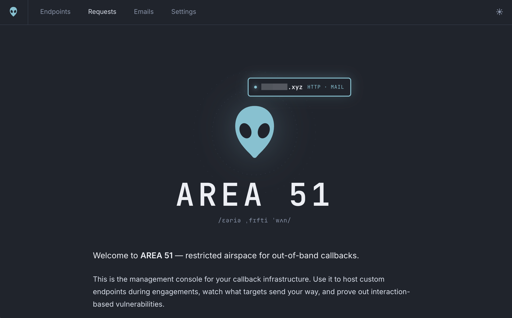
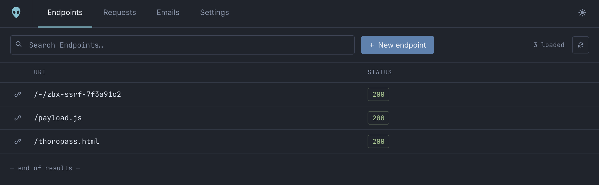
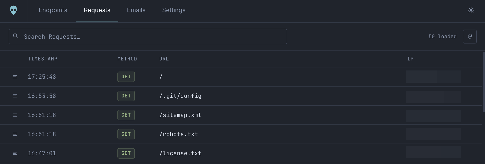
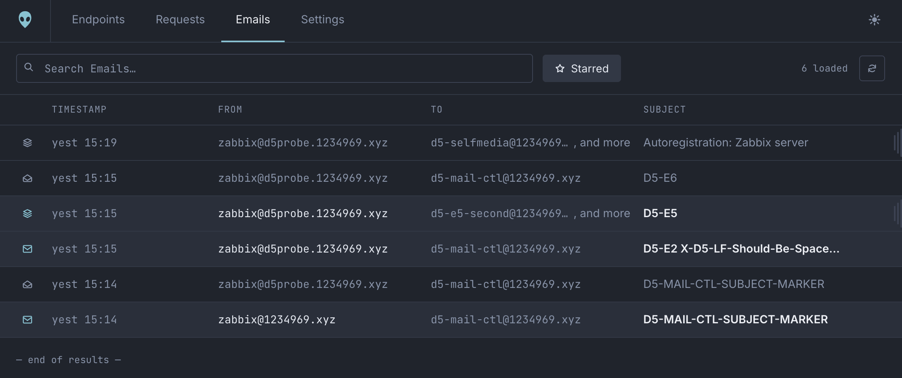

<div align="center">

<picture>
  <source media="(prefers-color-scheme: dark)" srcset=".github/assets/brand/lockup-dark.png">
  <source media="(prefers-color-scheme: light)" srcset=".github/assets/brand/lockup-light.png">
  
</picture>

<a href="https://thoropass.com">
  <picture>
    <source media="(prefers-color-scheme: dark)" srcset=".github/assets/brand/byline-dark.png">
    <source media="(prefers-color-scheme: light)" srcset=".github/assets/brand/byline-light.png">
    
  </picture>
</a>

### Every callback, captured.

**The exploit server for out-of-band findings.** Point a target at a domain you
own. Every HTTP request and every email it sends back lands in a dashboard you
control, and it gets whatever response you choose in return.

[](LICENSE)
[](docs/internals/architecture.md)
[](#requirements)
[](docs/internals/autopilot.md)

[Getting started](docs/guides/getting-started.md) ·
[Playbooks](docs/guides/usage.md) ·
[CLI](docs/reference/cli.md) ·
[Architecture](docs/internals/architecture.md) ·
[Documentation](docs/README.md)

</div>

> ⚠️ **For authorized security testing and research only.** A black hole is a
> live, internet-reachable catch-all: everything a target sends it is stored, and
> it serves back whatever you configure. Only point targets you have **explicit,
> written authorization** to test at it, and treat every deployment as
> client-data storage. Test only what you are authorized to test.

---

## Why it exists

Half of what you find on an engagement only proves itself when something calls
home. A blind SSRF. An XXE that exfiltrates over HTTP. A stored XSS firing in an
admin's browser you will never see. A password-reset flow you need to read. An
OAuth `redirect_uri` nobody validated. Each one needs infrastructure that is
reachable from the target, captures everything, and answers exactly how you want.

Public interaction services give you a hostname and a log. AREA 51 gives you the
whole thing, on infrastructure you own:

- **Nothing shared.** Your domains, your storage, your captures. No third party
  holds your clients' tokens, reset links or internal hostnames.
- **Any response you like.** A `302` into a metadata endpoint, a DTD, a `.js`
  beacon, a JSON stub, a 25 MB binary. Per exact path.
- **Email is a first-class capture.** Every address at the domain is live, and
  every message is kept verbatim, headers and attachments included.
- **Your agent can drive it.** An MCP server exposes recent captures and a
  sandboxed slice of the endpoint table, so an AI agent can inject a callback URL
  and confirm the hit without you in the loop.
- **One command to stand up, one to tear down.** No servers, no containers, no
  cron host, and no bill at pentest volumes.

> **Released early, on purpose.** AREA 51 began as an internal tool for a small,
> trusted team, so it favors simplicity over hardening and scale. Expect rough
> edges. If you hit one, [open an issue](https://github.com/heylaika/area51/issues)
> with repro steps. Contributions are welcome; see [CONTRIBUTING.md](CONTRIBUTING.md).

## The three pieces

<table>
<tr>
<td width="33%" valign="top">

**AREA 51** · the dashboard

Configure endpoints, read captured requests and email, manage noise filters.
Locked behind single sign-on with an emailed one-time PIN.

</td>
<td width="33%" valign="top">

**Black Holes** · your domains

Every path serves what you defined, and every request and every address at the
domain is captured. Public by necessity, because targets have to reach it.

</td>
<td width="33%" valign="top">

**Autopilot** · the agent interface

A key-authenticated MCP + REST server. Reads the last hour of callbacks,
stages its own response stubs, and cannot touch anything else.

</td>
</tr>
</table>

### Drive it from an agent 🆕

Cool and easy: **Autopilot** exposes an MCP server (with a REST mirror) so an
authorized AI agent can run the loop itself mid-engagement, without you in the
middle of it. It reads the last hour of callbacks, stages its own response stub
under the fenced `/-/*` namespace, and confirms the hit. Every operator gets
their own API key, and it is sandboxed: it can never read your files, or any
endpoint outside `/-/`. → [Autopilot internals](docs/internals/autopilot.md)

## What it looks like

<table>
<tr>
<td width="50%"></td>
<td width="50%"></td>
</tr>
<tr>
<td width="50%"></td>
<td width="50%"></td>
</tr>
</table>

## What you can do with it

| Finding | How AREA 51 proves it | Playbook |
|---|---|---|
| Blind SSRF | An unconfigured path already captures the hit, with egress IP, User-Agent and every header | [→](docs/guides/usage.md#confirm-a-blind-callback-ssrf) |
| SSRF filter bypass | A text endpoint answers `302` into the address you actually want fetched | [→](docs/guides/usage.md#control-the-response-redirects-and-metadata) |
| XXE / XSLT exfiltration | Host the external DTD, then read the exfiltrated bytes out of the second request | [→](docs/guides/usage.md#host-a-dtd-for-xxe-exfiltration) |
| Blind XSS | Serve the beacon; the capture's `Referer` names the internal page that executed it | [→](docs/guides/usage.md#catch-a-blind-xss-beacon) |
| Email-driven flows | Every address is a live inbox, so signup, invite, reset and verification mail arrives in full | [→](docs/guides/usage.md#drive-email-flows-signup-reset-verification) |
| OAuth `redirect_uri` abuse | Stage the landing page and capture the `code`, `state` or token the flow hands over | [→](docs/guides/usage.md#intercept-an-oauth-redirect_uri) |
| Payload delivery | Upload an archive, binary, PDF or font and serve it inline with its own content type | [→](docs/guides/usage.md#host-a-file-payload) |
| Mail authentication review | The full `Received` chain plus SPF, DKIM and DMARC results on real delivered mail | [→](docs/guides/usage.md#drive-email-flows-signup-reset-verification) |

<!--
  Optional "How it compares" table, mirroring WRAITH's positioning section. Your
  CLAUDE.md keeps the README deliberately light, so this is opt-in: delete it if
  it feels like too much, or keep it for the scannable at-a-glance contrast.

## How it compares

Public interaction services give you a hostname and a log. AREA 51 gives you the
whole interaction, self-hosted:

| | AREA 51 | Burp Collaborator | interactsh | XSS Hunter / ezXSS |
|---|---|---|---|---|
| Self-hosted, you own the data | **Yes** | No (SaaS) | Yes | Yes |
| Full HTTP request capture | **Yes** | Yes | Yes | via payload |
| Email capture (catch-all, raw .eml) | **Yes** | Limited | No | No |
| Serve a custom response / host a file | **Yes** | No | No | No |
| Dashboard UI | **Yes** | In Burp | CLI | Yes |
| Agent-drivable (MCP) | **Yes** 🆕 | No | No | No |
-->

## Requirements

- A **Cloudflare account** with a domain already added as a zone. Ideally a
  throwaway with no prior mail records, since it will end up in target logs.
- **R2 object storage** enabled, and **Zero Trust** activated once. One click
  each; neither can be turned on through the API.
- **Node.js 20+**.
- One **API token**. The exact permission list is in
  [getting-started](docs/guides/getting-started.md#api-token).

Everything else is created for you: the database, storage, three Workers, the
dashboard, DNS, TLS, mail routing and the access policy.

## Getting started

First work through **[Requirements](#requirements)** above. The API token and the
two one-click activations (R2 and Zero Trust) **cannot be done through the API**,
so those come first, by hand. Then:

```bash
git clone https://github.com/heylaika/area51.git && cd area51
npm install
cp .env.example .env        # paste your API token
./a51 setup                 # provisions and deploys everything
```

`setup` asks which domain to use, confirms that it may take that domain over,
then provisions in order: database and schema → storage → the three Workers →
your black hole and its mail catch-all → the dashboard with its bindings already
attached → DNS → the access policy. The domain becomes the black hole itself, so
`https://your-domain/anything` and `anything@your-domain` are both captured, and
the console and agent server are set up alongside it. Every step is idempotent,
so it is also the command you re-run after changing anything.

Then confirm it:

```bash
./a51 doctor
```

`doctor` checks every binding, domain and policy, then probes the live hosts. A
request to any path on your black hole should answer `404! Not Found` and appear
in the dashboard seconds later; mail to any address at it lands in the same place.

Full walkthrough, with the manual fallback for every step:
**[docs/guides/getting-started.md](docs/guides/getting-started.md)**.

## Documentation

| | |
|---|---|
| **[Getting started](docs/guides/getting-started.md)** | Prerequisites, token permissions, every setup step and its manual equivalent |
| **[Playbooks](docs/guides/usage.md)** | Running an engagement: SSRF, XXE, blind XSS, email flows, OAuth, payload hosting, evidence |
| **[Operations](docs/guides/operations.md)** | Deploys, domains, purging, retention, logs, quotas, teardown |
| **[Troubleshooting](docs/guides/troubleshooting.md)** | Symptom → cause → fix |
| **[CLI](docs/reference/cli.md)** · **[Configuration](docs/reference/configuration.md)** | Every command; every `.env` value |
| **[API](docs/reference/api.md)** · **[Database](docs/reference/database.md)** | The dashboard's HTTP API; tables and buckets |
| **[Internals](docs/internals/architecture.md)** | Architecture, catcher, Autopilot, dashboard, retention |
| **[Decisions](docs/decisions.md)** | Why the non-obvious choices are the way they are |

Start at **[docs/README.md](docs/README.md)** for the full map.

## Contributing

Contributions are welcome, bug reports and playbooks and new capture recipes
especially. See **[CONTRIBUTING.md](CONTRIBUTING.md)** to get set up. To report a
security issue **in AREA 51 itself**, follow **[SECURITY.md](SECURITY.md)** rather
than opening a public issue.

## License and attribution

AREA 51 is **© Copyright 2026 Thoropass, Inc.**, licensed and released under the **[Apache License 2.0](LICENSE)**.
See [NOTICE](NOTICE) for third-party components.

Built with ❤️ by the Pentest Team at **[Thoropass](https://thoropass.com)**.
