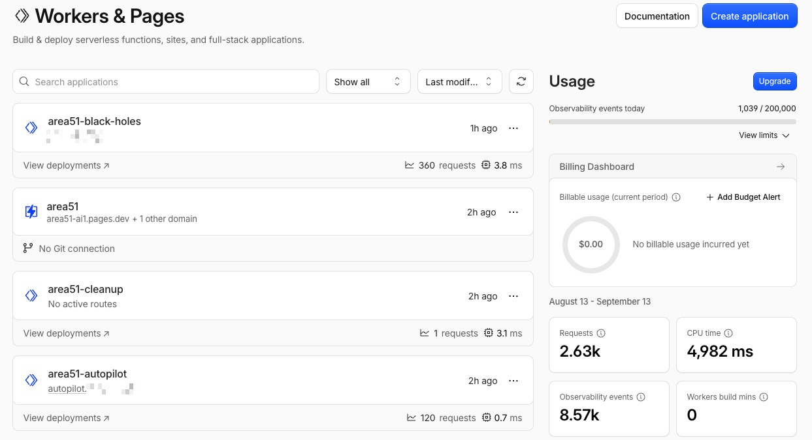
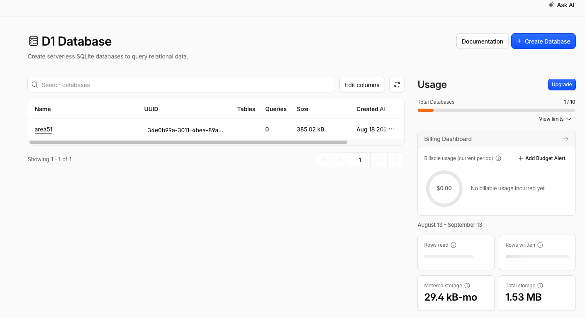
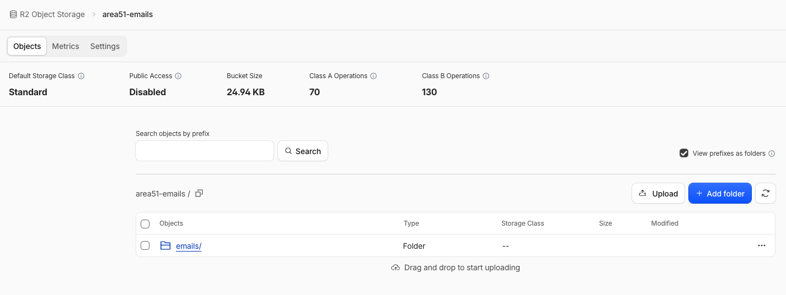
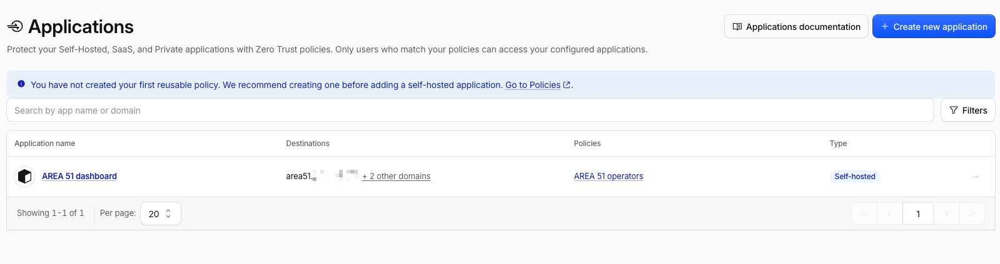
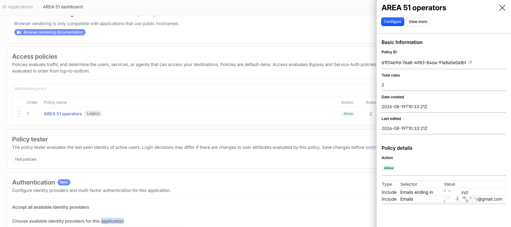
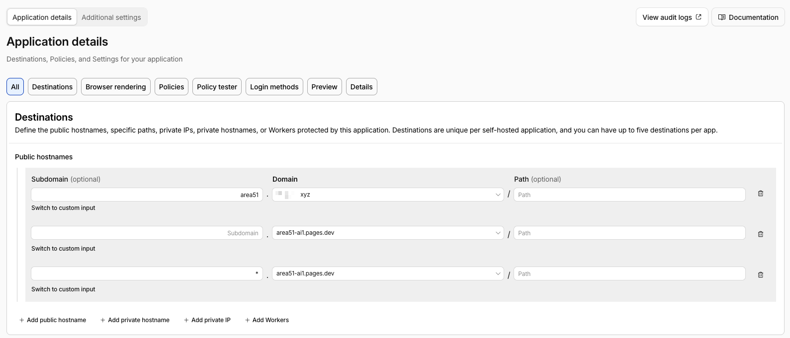
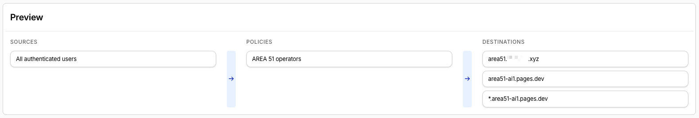

# Deployment reference: a healthy deployment in the Cloudflare dashboard

After `./a51 setup` finishes (and the manual prerequisites are done, see
[getting-started.md](getting-started.md)), this is what a correctly-provisioned AREA 51 deployment
looks like in the Cloudflare dashboard. Use it to eyeball that everything landed;
`./a51 doctor` checks the same things programmatically.

> The screenshots are from a real deployment on a throwaway zone; account ids,
> the zone name and email addresses are partly redacted.

---

## Workers & Pages

The three Workers and the Pages project, all deployed:



- **area51-black-holes** is the public catcher (HTTP + email).
- **area51-autopilot** is the agent-facing REST + MCP server, on its own hostname.
- **area51-cleanup** is the retention worker; **no active routes** (cron only).
- **area51** is the dashboard, a Pages project served at `area51-xxxx.pages.dev`
  ( *+ 1 other domain* = the custom `area51.<zone>` domain). The `-xxxx` suffix is
  Cloudflare disambiguating a globally-taken `*.pages.dev` name. Expected, and
  the reason Access must also guard the pages.dev URL (below). Yours will carry a
  different suffix; the screenshots on this page show one real assignment, so read
  `area51-xxxx` wherever they show a concrete one.

---

## D1 database

One database, `area51`, holds all metadata (six tables, no message bodies):



Created by setup; `./a51 doctor` verifies the schema and every binding onto it.

---

## R2 object storage

Captured email lives in the **area51-emails** bucket, with **Public Access
Disabled** and the verbatim `.eml` objects under the `emails/` prefix:



There is a second bucket, **area51-files**, for file-backed endpoint uploads
(not shown). Both are private, so nothing in R2 is publicly reachable.

---

## Cloudflare Access (Zero Trust)

Access is the dashboard's **only** authentication. These three views confirm it
is configured correctly, including that the `*.pages.dev` URL is guarded, so the
dashboard can't be reached unauthenticated by its Pages URL.

### The application

A self-hosted application, **AREA 51 dashboard**, with an **AREA 51 operators**
allow policy. Note *+ 2 other domains* under Destinations, because the app protects more
than just the custom hostname:



### The allow policy

Default-deny, with one **Allow** policy of two include rules: an email-domain
rule and an exact-address rule (built from `ALLOWED_EMAILS`). Only these
identities get a one-time PIN and in:



### Destinations, and the closed pages.dev bypass

The important one. The application guards **three** public hostnames:

1. `area51.<zone>`, the custom dashboard domain
2. `area51-xxxx.pages.dev`, the Pages **apex** URL
3. `*.area51-xxxx.pages.dev`, every **preview / branch** deployment URL



If only the custom domain were listed, anyone with the `*.pages.dev` URL could
reach the dashboard with **no login**. `./a51 setup` and `./a51 access apply` add all
three automatically, and `./a51 doctor` fails if the pages.dev destination is
ever missing.

### Preview

The end-to-end summary: **all authenticated users** matching the **AREA 51
operators** policy may reach the three destinations:



---

## Cross-check with the CLI

Everything above is what these commands assert without opening the dashboard:

```bash
./a51 status     # what is deployed, and where
./a51 doctor     # every binding, domain, policy, and probes the live hosts
```

`doctor` specifically confirms the Workers and Pages bindings, the D1 schema,
both R2 buckets, the Access application **and** that its destinations include the
`*.pages.dev` URL.
