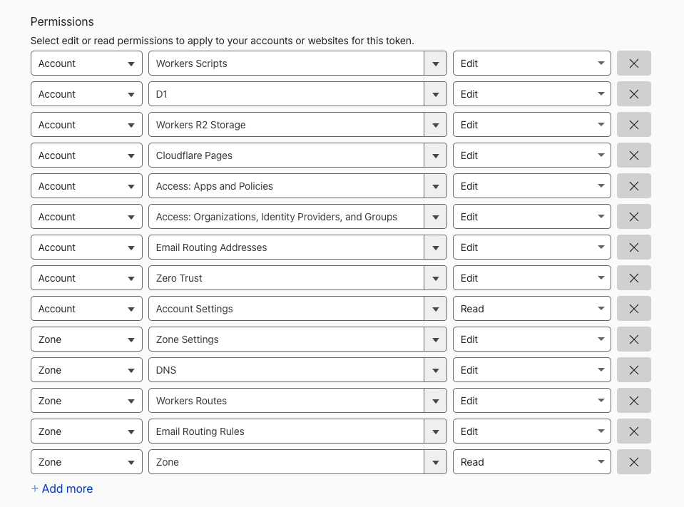

# Deployment reference: a healthy deployment in the Cloudflare dashboard

After `./a51 setup` finishes (and the manual prerequisites are done, see
[getting-started.md](getting-started.md)), this is what a correctly-provisioned AREA 51 deployment
looks like in the Cloudflare dashboard. Use it to eyeball that everything landed;
`./a51 doctor` checks the same things programmatically.

> The screenshots are from a real deployment on a throwaway zone; account ids,
> the zone name and email addresses are partly redacted.

---

## API token

Everything below was provisioned by a single **Custom token** (My Profile → API
Tokens → Create Token). A correct token carries exactly these **fourteen**
permissions: nine Account-scoped, five Zone-scoped.

*Cloudflare Pages · Edit* is still among them even though nothing here creates a
Pages project: it is what lets a confirmed takeover detach a Pages project's
custom domain when one holds a hostname a black hole needs
([getting-started](getting-started.md#api-token)).



- **Account** · Workers Scripts, D1, Workers R2 Storage, Cloudflare Pages,
  Access: Apps and Policies, Access: Organizations Identity Providers and Groups,
  Email Routing Addresses, Zero Trust, all **Edit**; Account Settings, **Read**.
- **Zone** · Zone Settings, DNS, Workers Routes, Email Routing Rules, all
  **Edit**; Zone, **Read**.


---

## Workers & Pages

All four Workers, deployed. There is no Pages project: the dashboard has been a
Worker with static assets since v1.1.0
([why](../decisions.md#the-dashboard-is-a-worker-not-a-pages-project)).


- **area51-black-holes** is the public catcher (HTTP + email).
- **area51-autopilot** is the agent-facing REST + MCP server, on its own hostname.
- **area51-cleanup** is the retention worker; **no active routes** (cron only).
- **area51-dashboard** is the dashboard, on the single custom domain
  `area51.<zone>` and **nothing else** — no `*.workers.dev` route and no preview
  URLs, because its config sets `workers_dev = false` and `preview_urls = false`.
  One hostname is the whole point: it is the only thing Access has to guard.

> **Screenshots on this page predate v1.1.0** and still show the dashboard as a
> Pages project (`area51-xxxx.pages.dev`) with three Access destinations. The
> text describes the current state; treat the images as illustrative of layout,
> not of the hostname list. They will be retaken.


---

## D1 database

One database named `area51`, and only one. This is the account-level list, so
what it confirms is that setup created exactly one and did not leave a duplicate
behind:


The *Tables* column is blank here because Cloudflare populates it lazily; it is
not evidence of an empty database. Inside are the seven tables from
[db/schema.sql](../../db/schema.sql), holding metadata only and no message bodies.
`./a51 doctor` is what actually verifies the schema, naming any table or
late-added column that is missing, plus every binding onto the database.

---

## R2 object storage

Captured email lives in the **area51-emails** bucket, with **Public Access
Disabled** and the verbatim `.eml` objects under the `emails/` prefix:


There is a second bucket, **area51-files**, for file-backed endpoint uploads
(not shown). Both are private, so nothing in R2 is publicly reachable.

---

## Cloudflare Access (Zero Trust)

Access is the dashboard's **only** authentication. These three views confirm it
is configured correctly.

### The application

A self-hosted application, **AREA 51 dashboard**, with an **AREA 51 operators**
allow policy. Destinations lists exactly one hostname:


### The allow policy

Default-deny, with one **Allow** policy holding a single include rule: *emails in
a list*, pointing at the Zero Trust email list named by `ACCESS_LIST_ID`. The
addresses in that list are a projection of the `email` column of the D1 `users`
table, replaced wholesale by `./a51 users` on every add and remove, so editing
the list here does not survive the next command. Only those identities get a
one-time PIN and in:


### Destinations

One public hostname destination: `area51.<zone>`, the dashboard's Custom Domain.


**This used to be the most important check on the page, and it is now trivial —
which was the point of the migration.** A Cloudflare Pages project answers on its
custom domain *and* `<project>.pages.dev` *and* every `*.pages.dev` preview
deployment. Access is enforced per hostname, so an app listing only the custom
domain left the rest reachable with **no login**, straight into every captured
request and email. The application therefore had to guard three hostnames — and
the wildcard does not match the apex, so both extras were needed and each was
separately forgettable. `doctor` had a check whose only job was to fail the
deployment if either went missing.

The dashboard Worker answers on one name. There is no second URL to enumerate, no
wildcard to remember, and no bypass to close.

### Preview

The end-to-end summary: **all authenticated users** matching the **AREA 51
operators** policy may reach the destination:


---

## Cross-check with the CLI

Everything above is what these commands assert without opening the dashboard:

```bash
./a51 status     # what is deployed, and where
./a51 doctor     # every binding, domain, policy, and probes the live hosts
```

`doctor` specifically confirms all four Workers' bindings (the dashboard's `DB`,
`EML` and `FILES` among them), the D1 schema, both R2 buckets, the dashboard's
Custom Domain, and the Access application with its allow policy.
