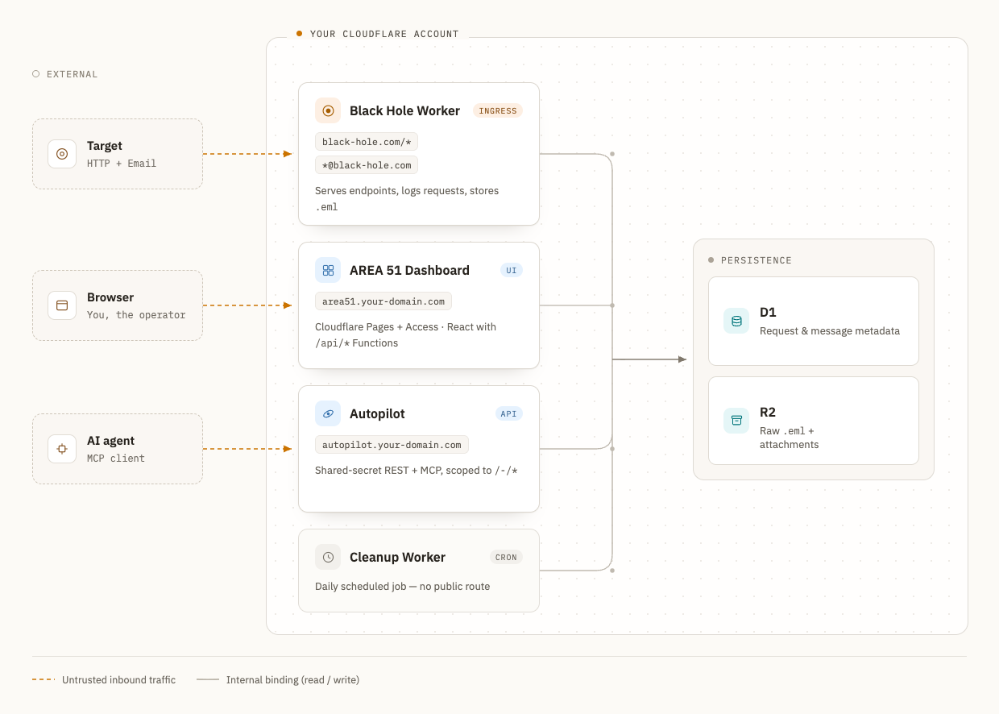

# Architecture

Everything runs on one Cloudflare account. There are three Workers, one Pages
project, one D1 database and two R2 buckets. No origin server, no container, no
long-lived process.




## Components

| Piece | Implementation | Responsibility |
|---|---|---|
| **AREA 51** (dashboard) | Cloudflare Pages project (`PAGES_PROJECT_NAME`) | Static React UI plus Pages Functions that serve the JSON API. The only writer of endpoint definitions, blacklists and per-email read/starred state. |
| **Black Holes** (catcher) | one Worker (`WORKER_NAME`), bound by Custom Domain to every black hole | Serves endpoint responses; logs every request; captures every inbound email. Domain-agnostic: it does not know or care which black hole a request arrived on. |
| **Autopilot** (agent interface) | a second Worker (`AGENT_WORKER_NAME`) on its own Custom Domain | Secret-authenticated REST + MCP server. Recent-capture reads and CRUD confined to the `/-/*` endpoint namespace. |
| **Cleanup** (retention) | a third Worker (`CLEANUP_WORKER_NAME`), cron trigger only, no domain | Daily: trims `requests` to the newest N rows, deletes non-starred `emails` older than M days along with their `.eml` objects. |
| **D1 database** | binding `DB` on all three Workers and on Pages | Six tables. Metadata only, so no message bodies and no uploaded bytes. |
| **R2: captured email** | binding `EML` (worker, autopilot, cleanup, Pages) | One verbatim `.eml` per captured message at `emails/<id>.eml`. |
| **R2: endpoint files** | binding `FILES` (worker + Pages only) | One object per file-backed endpoint, keyed by a random UUID. |
| **Email Routing** | per mail-enabled zone | A catch-all rule that hands every inbound message to the catcher's `email()` handler. |
| **Cloudflare Access** | Zero Trust app on the dashboard hostname | The dashboard's only authentication. |

Three Workers and the Pages project are deployed **independently** and share
state exclusively through D1 and R2. There is no service binding, no queue and
no RPC between them.

## HTTP capture flow

```
target ──► https://<black-hole>/some/path
              │
              ▼
         BlackHoles.fetch()
              │
              ├─ load ip_blacklist (edge-cached 60 min)
              │     hit → 403, nothing stored, endpoint never consulted
              │
              ├─ build the log row: id, ts, method, full url, ip, ua, headers, body
              ├─ ctx.waitUntil(INSERT INTO requests)      ← never blocks the response
              │
              ├─ SELECT status, headers, body, r2_key FROM endpoints WHERE uri = pathname
              │
              ├─ no row          → 404 "404! Not Found"
              ├─ row with r2_key → stream the object from the files bucket,
              │                     200 + the object's own Content-Type, inline
              └─ text row        → row.status + JSON.parse(row.headers) + row.body
```

Matching is **exact** on `url.pathname`: no globs, no path parameters, no
precedence rules ([decisions.md](../decisions.md#endpoints-are-exact-match-not-glob)).
Query strings are captured but ignored for matching.

The request log is fire-and-forget. If the insert fails, a `http_log_insert_failed`
log line is emitted and the capture is lost, because the response has already
gone out.
There is no retry queue.

## Email capture flow

```
sender ──► anything@<mail-enabled black hole>
              │  (Cloudflare Email Routing catch-all)
              ▼
         BlackHoles.email(message)
              │
              ├─ id = uuid, ts = now
              ├─ buf = await message.raw → ArrayBuffer        (readable once)
              ├─ parsed = postal-mime.parse(buf)              (subject, attachment count)
              ├─ fromAddr = parsed.from.address               (the From: header, not the envelope)
              │
              ├─ load email_blacklist (edge-cached 60 min)
              │     hit → message.setReject(), nothing stored, sender gets a bounce
              │
              ├─ R2.put("emails/<id>.eml", buf)               ← the verbatim message
              ├─ INSERT INTO emails (id, ts, from, to, subject, attachment_count)
              │
              └─ on ANY error above:
                    forward(message → FALLBACK_ADDRESS)       ← so it is not lost
                    R2.delete + DELETE FROM emails            ← roll back partial writes
```

Capture is **all-or-nothing**. Success means both the object and the row exist;
failure means neither does and the original is in the fallback inbox. There are
no marker rows, and no size or attachment thresholds: every message is stored in
full. The handler never re-throws.

D1 and R2 share no transaction, so the rollback is a pair of compensating
deletes. A failed compensating delete is logged (`email_rollback_r2_failed` /
`email_rollback_d1_failed`) and at worst leaves an invisible orphaned object,
never a visible half-email.

## Dashboard flow

```
operator ──► https://<dashboard>
                │
                ├─ Cloudflare Access challenge (one-time PIN by email)
                ▼
             Pages
                ├─ /, /index.html, /styles.css, /js/*.jsx   → static files
                └─ /api/*                                    → Pages Functions
                        ├─ endpoints  GET · POST · GET/[uri] · DELETE/[uri] · POST /upload
                        ├─ requests   GET · GET/[id]
                        ├─ emails     GET · PATCH · GET/[id] · PATCH/[id] · GET/[id]/raw
                        ├─ blacklist  GET · POST · DELETE  (ips, emails)
                        └─ config     GET /domains
                        │
                        ▼
                    env.DB (D1) + env.EML / env.FILES (R2)
```

The browser renders JSX at runtime (React + Babel from a CDN), so there is no
build step ([decisions.md](../decisions.md#no-build-pipeline-for-the-frontend)).

## Agent flow

```
Claude Code ──MCP──► https://<autopilot>/mcp        (X-A51-Secret on every call)
                        │
                        ├─ requests_recent_1hr   ─► SELECT … WHERE ts >= now-60min
                        ├─ emails_recent_1hr     ─► SELECT … WHERE ts >= now-60min
                        ├─ email_raw {id}        ─► R2 GET, gated on the same 60-min window
                        ├─ list_black_holes      ─► SELECT * FROM domains
                        └─ autopilot_endpoints_*  ─► CRUD, hard-limited to URIs under /-/
```

The 60-minute window and the `/-/` prefix are hardcoded server-side; a client
cannot widen either. See [autopilot.md](autopilot.md).

## Where each piece of state lives

| State | Home | Written by | Read by |
|---|---|---|---|
| Endpoint definitions | D1 `endpoints` | dashboard, Autopilot (`/-/*` only) | catcher |
| Uploaded endpoint payloads | R2 files bucket | dashboard | catcher |
| Captured requests | D1 `requests` | catcher | dashboard, Autopilot, cleanup |
| Captured email metadata | D1 `emails` | catcher (insert), dashboard (read/starred) | dashboard, Autopilot, cleanup |
| Captured email bodies | R2 email bucket | catcher | dashboard, Autopilot, cleanup (delete) |
| Blacklists | D1 `ip_blacklist`, `email_blacklist` | dashboard | catcher (60-min edge cache) |
| Configured black holes | D1 `domains` | `./a51 domains` | dashboard, Autopilot |
| Deployment configuration | `.env` on the operator's machine | `./a51 setup` | the CLI, wrangler |
| Autopilot secret | encrypted Worker Secret + `.env` | `./a51 deploy autopilot`, `./a51 rotate-secret` | Autopilot worker |

Nothing is cached anywhere else. There is no KV namespace, no Durable Object and
no in-memory state that survives a request, apart from the blacklists' edge cache.
